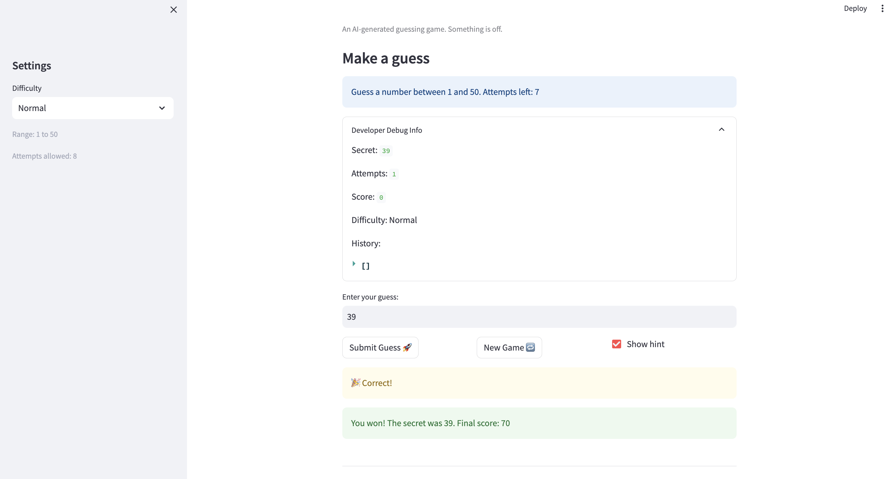

# 🎮 Game Glitch Investigator: The Impossible Guesser

## 🚨 The Situation

You asked an AI to build a simple "Number Guessing Game" using Streamlit.
It wrote the code, ran away, and now the game is unplayable. 

- You can't win.
- The hints lie to you.
- The secret number seems to have commitment issues.

## 🛠️ Setup

1. Install dependencies: `pip install -r requirements.txt`
2. Run the broken app: `python -m streamlit run app.py`

## 🕵️‍♂️ Your Mission

1. **Play the game.** Open the "Developer Debug Info" tab in the app to see the secret number. Try to win.
2. **Find the State Bug.** Why does the secret number change every time you click "Submit"? Ask ChatGPT: *"How do I keep a variable from resetting in Streamlit when I click a button?"*
3. **Fix the Logic.** The hints ("Higher/Lower") are wrong. Fix them.
4. **Refactor & Test.** - Move the logic into `logic_utils.py`.
   - Run `pytest` in your terminal.
   - Keep fixing until all tests pass!

## 📝 Document Your Experience

**Game purpose:** A number guessing game where the player tries to guess a secret number within a limited number of attempts, with hints guiding them higher or lower.

**Bugs found:**
- Hints were backwards — "Go Higher" showed when the guess was too high, and vice versa
- Difficulty ranges didn't match their labels (Easy, Normal, Hard were not in ascending order)
- On even-numbered attempts, the secret number was cast to a string, making correct guesses impossible to match
- The "New Game" button didn't reset attempts properly

**Fixes applied:**
- Swapped the "Go Higher" / "Go Lower" hint messages so they match the correct direction
- Corrected the number ranges for each difficulty level
- Removed the int/string alternating logic so the secret is always compared as an integer
- Fixed the New Game button to properly reset game state

## 📸 Demo

## 🚀 Stretch Features

- [ ] [If you choose to complete Challenge 4, insert a screenshot of your Enhanced Game UI here]
